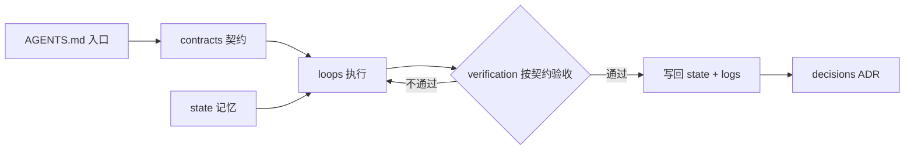

# Asterism Knowledge Base

> 本目录是 Asterism 项目的**单一事实源（single source of truth）**。所有 agent 在执行任何任务前，都应先读取本知识库；它是纯 markdown、工具无关的，可在 Cursor / Claude Code / Codex 等不同 harness 间复用。

## 这是什么

`knowledge/` 不是普通的 `docs/`。它面向 **Loop Engineering**（2026）组织：把工程协作的重点从"写好一次性 prompt"转向"设计一个能自我修正、迭代到验证通过才停止的循环"。

为支撑这种循环，知识被显式分层。每一层回答一个不同的问题：

| 层 | 目录 | 回答的问题 |
| --- | --- | --- |
| 契约 Contracts | `contracts/` | 什么是"对"？什么算"完成"？（verification gate 的依据） |
| 决策 Decisions | `decisions/` | 我们为什么这样选？有哪些取舍？（ADR） |
| 路线图 Roadmap | `roadmap.md` | 我们分几个阶段、先做什么后做什么？ |
| 循环 Loops | `loops/` | 可复用的工作流程是怎样的？（带 goal / verification / guardrails） |
| 技能 Skills | `skills/` | 项目认可哪些 agent skills？何时使用？如何同步？ |
| 持久状态 State | `state/` | 上次进行到哪了？有哪些便签和待办？（跨会话的"记忆"） |
| 运行手册 Runbooks | `runbooks/` | 怎么把它跑起来/部署？ |
| 运行日志 Logs | `logs/` | 每一轮 loop 实际发生了什么？（用于改进循环本身） |

### 为什么分这几层

模型没有跨会话记忆，单纯堆 prompt 会反复从零开始并产生漂移。Loop Engineering 用以下结构对抗这一点：

- **Contracts 契约**：定义"对"与"完成"，是 verification 的客观依据，避免"看起来差不多就收工"。
- **Durable State 持久状态**：把进度、便签、待办存在 context 之外的"便签纸"上，让下一次会话能恢复记忆。
- **Loops 循环**：把可复用流程固化为带目标、验收、护栏、停止条件的循环定义，可被反复执行与改进。
- **Verification + Guardrails 验证与护栏**：以契约验收为闸门，配合沙箱 / 预算 / 迭代上限，防止循环失控漂移。
- **Logs 运行日志**：记录每轮 loop 的目标 / 迭代 / 验证结果 / 成本，用来改进循环本身，而不只是改进一次产物。

## 目录地图

```text
knowledge/
├── README.md              # 导航 + 维护约定（loop 中如何读/写本知识库）
├── contracts/             # 契约层：定义"对"与"完成"（verification 依据）
│   ├── product.md         #   产品契约：功能范围 + 验收标准
│   ├── architecture.md    #   架构契约（系统结构 / 技术栈 / monorepo / 数据流 / OAuth）
│   ├── data-model.md      #   数据模型契约：schema + RLS 约束
│   ├── conventions.md     #   编码 / 命名 / 提交 / 安全 / i18n / 发布规范契约
│   └── ui-ux.md           #   设计契约：tokens(待填) / 明暗 / 组件规范 / a11y / 品牌语气
├── decisions/             # 决策日志：ADR（一条决策一个文件，背景 / 取舍 / 结论）
│   ├── 0001-supabase-baas.md
│   ├── 0002-pnpm-over-bun.md
│   └── 0003-commitlint-lefthook.md
├── roadmap.md             # 分阶段路线图（Phase 0-4）
├── loops/                 # Loop 层：可复用的 agent 循环定义
│   ├── README.md          #   loop 清单与用法
│   ├── _template.loop.md  #   模板：goal / inputs / steps / verification / guardrails / stop
│   └── ui-generation.loop.md  # UI 生成循环：生成 → 对齐 ui-ux 契约 → 落 packages/ui → a11y 验收
├── skills/                # Skills 层：项目级 agent skills 清单、vendor 副本与同步规则
│   ├── README.md          #   skill 治理规则与使用场景
│   ├── manifest.json      #   上游来源、锁定 commit、vendor 与 .agents 同步目标
│   └── vendor/            #   外部 skill 的仓库内可审计副本
├── state/                 # 持久状态层：跨会话存活的"记忆"
│   ├── PROGRESS.md        #   当前进度与里程碑
│   ├── NOTES.md           #   工作便签（context 之外）
│   └── BACKLOG.md         #   待办与已知问题
├── runbooks/              # 操作手册
│   └── self-host.md       #   自托管 / 本地起步
└── logs/                  # 运行日志层：每次 loop 运行记录
    └── 2026-06-29-init.md #   首次初始化记录
```

## 如何在 loop 中读写本知识库（维护协议）

任何 agent 在一次任务的生命周期里，都应遵守以下读写纪律。这是把知识库变成"活的"而非"死文档"的关键。

1. **任务开始 — 先读契约与进度**
   - 先读 `contracts/`，明确这次任务"什么是对、什么算完成"。
   - 再读 `state/PROGRESS.md`，恢复上次中断点与里程碑；必要时读 `state/NOTES.md` 与 `state/BACKLOG.md`。

2. **执行 — 按 loops/ 走**
   - 找到对应的循环定义（如 `loops/ui-generation.loop.md`），按其 `steps` 执行；没有现成循环时，用 `loops/_template.loop.md` 临时定义一个。
   - 全程遵守循环里的 `guardrails`（预算 / 迭代上限 / 边界）。

3. **完成判定 — 以契约验收**
   - 完成与否由 `contracts/` 的验收标准（Definition of Done）裁定，而非主观感觉。
   - 未通过则回到执行步骤继续迭代，直到通过或触发停止条件。

4. **结束 — 写回状态与日志**
   - 更新 `state/PROGRESS.md`（进度 / 里程碑）、必要时更新 `state/NOTES.md` 与 `state/BACKLOG.md`。
   - 在 `logs/` 追加一条本轮 loop 记录（目标 / 迭代次数 / 验证结果 / 成本 / 遗留）。

5. **重要决策 — 记 ADR**
   - 任何影响架构、技术选型、规范的决策，写入 `decisions/` 新增一条 ADR（编号递增，含背景 / 取舍 / 结论）。
   - 契约因决策而变更时，同步更新对应的 `contracts/*.md`。

> 一句话纪律：**先读契约与状态，按循环执行，以契约验收，写回状态与日志，决策落 ADR。** 任何代码或配置变更，都必须同步更新本知识库。

## 闭环


