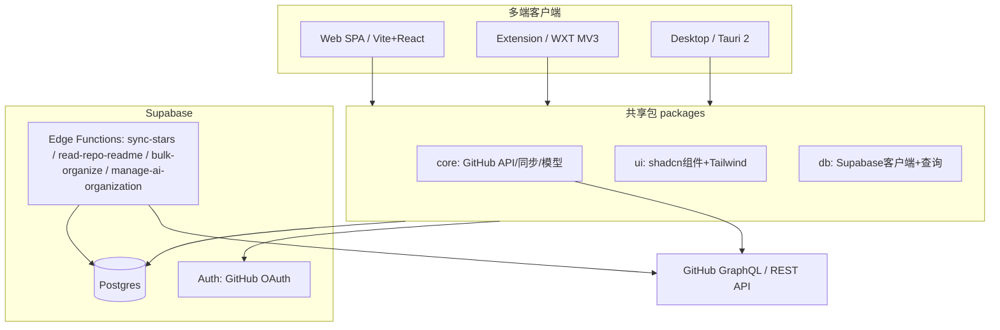
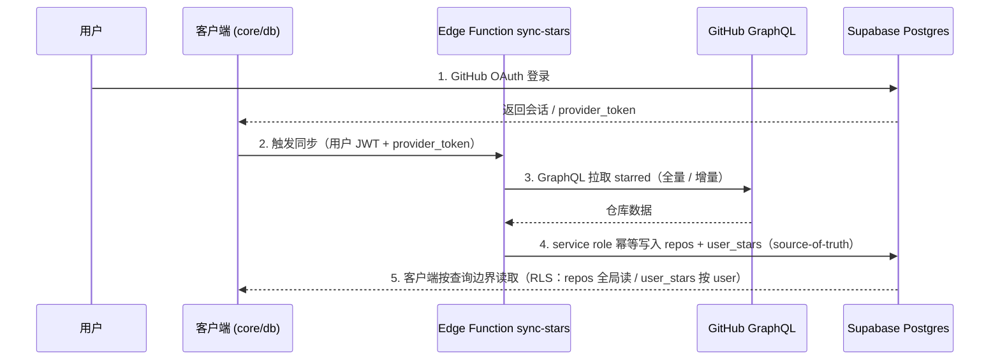

# Architecture Contract · 架构契约

> 本文件定义 Asterism 的系统架构、技术栈、monorepo 蓝图、数据流与鉴权权限边界。架构变更须同步更新本文件，并在 `../decisions/` 记录对应 ADR。

## System Architecture · 系统架构

多端客户端共享 `core` / `ui` / `db` 三个包，统一对接 Supabase（Auth / Postgres / Edge Functions）；GitHub GraphQL / REST API 是上游数据源。



### 分层职责

- **clients（端）**：各端只负责平台壳与组装，业务逻辑下沉到共享包。
- **shared（共享包）**：跨端复用的核心；不含任何平台专有 API（见 `conventions.md` 目录边界）。
- **Supabase（后端）**：Auth 鉴权、Postgres 作为 source-of-truth、Edge Functions 承载同步与 AI 嵌入等服务端逻辑。业务数据不使用 Realtime 订阅；客户端在查询边界重新读取权威状态。
- **GitHub GraphQL / REST API**：上游数据源；stars 同步走 GraphQL，实时 README HTML 走受保护 Edge Function 调用 REST。

## Tech Stack · 技术栈

### 共享（跨端）

- **语言**：TypeScript（strict）
- **UI**：React + Tailwind CSS + shadcn/ui
- **数据请求 / 缓存**：TanStack Query
- **客户端状态**：Zustand
- **请求缓存**：TanStack Query（仅会话内；不承诺离线浏览）
- **大列表性能**：TanStack Virtual（虚拟滚动）
- **国际化**：react-i18next（跨 web / 扩展通用，最稳；默认 en + 内置 zh-CN）

### 各端

- **Web**：Vite + React + React Router；静态托管（Vercel / Netlify / Cloudflare Pages）。
- **Extension**：WXT（Manifest V3）；鉴权用 `chrome.identity.launchWebAuthFlow` 或共享 Supabase 会话。
- **Desktop**：Tauri 2，套用 web 前端。

### 运行时与工程基线

- Node 22 LTS、pnpm（`packageManager` 锁定）、Turborepo、Vite、Vitest、Biome、Changesets、lefthook + commitlint。
- 选型理由见 `../decisions/0001-supabase-baas.md`、`0002-pnpm-over-bun.md`、`0003-commitlint-lefthook.md`。

## Monorepo Blueprint · 仓库蓝图

> 本次初始化仅建立 monorepo 根配置，**不创建** `apps/*` 与 `packages/*` 的业务代码。下方为目标蓝图。

```text
asterism/
├── apps/
│   ├── web/            # Vite + React + React Router 的响应式 Web
│   ├── extension/      # WXT MV3 浏览器扩展
│   └── desktop/        # Tauri 2 桌面端
├── packages/
│   ├── core/           # 业务逻辑：GitHub API / 同步 / 领域模型（无平台专有 API）
│   ├── ui/             # shadcn/ui 组件 + Tailwind 设计系统
│   ├── db/             # 数据访问唯一入口：Supabase 客户端 + 查询
│   └── config/         # 共享工程配置（tsconfig / tailwind / biome 预设等）
└── supabase/
    ├── migrations/     # 数据库迁移（schema + RLS）
    └── functions/      # Edge Functions（sync-stars / read-repo-readme / bulk-organize / AI generation 等）
```

包命名遵循 `@asterism/*`；共享包为私有 workspace（不发 npm）。目录边界规则见 `conventions.md`。

## Data Flow · 数据流

核心数据流：以 GitHub 为上游、Postgres 为唯一持久化权威源、显式查询为客户端收敛边界、TanStack Query 提供会话内请求缓存。



1. **OAuth 登录**：经 Supabase GitHub provider 获取会话与 `provider_token`（GitHub 访问令牌）。
2. **触发同步**：客户端调用 Edge Function `sync-stars`，带上用户 JWT 与 `provider_token`。
3. **GraphQL pull stars**：函数调 GitHub GraphQL API 拉取 starred（支持增量）；纯查询/映射逻辑在 `core`。
4. **Postgres source-of-truth**：函数用 **service role** 幂等写入 `repos`（全局）与该用户 `user_stars`。`repos` RLS 仅允许受信路径写（见 `data-model.md`），故写入集中在函数，客户端不直写。
5. **读取 / 会话收敛**：客户端按 RLS 读取结果（`repos` 全局可读、`user_stars` 按 `user_id`）；进入页面、查询刷新、完成本地操作或重新连接后重新读取 Postgres。多个在线会话不承诺主动推送收敛。
6. **请求缓存**：客户端使用 TanStack Query 做会话内去重与新鲜度管理；不建立浏览器持久缓存，也不承诺离线读取。

> Stars 同步由受信 Edge Function `sync-stars` 执行，满足「全局 `repos` 仅受信路径写」的 RLS 约束。Phase 2 的批量整理先建立与 AI 无关的持久化执行路径：用户确认后固化 repository ID 范围与逐关系项目，服务端按有界批次执行并记录结果；成功项目不回滚，恢复时只领取待执行或可重试失败项目，幂等关系写保证重复提交不产生脏数据。客户端只经 `packages/db` 创建、触发、查询、重试或明确结束操作，并在查询边界重新读取权威状态。AI 整理建议同样由验证用户 JWT 的 Edge Function 调用 Generation Provider，但模型只返回建议草稿，确认后复用这条批量整理路径。每个用户最多一个活动草稿；新生成成功后原子替换旧草稿，生成失败保留旧草稿。现有关系建议默认选中，新分类默认未批准；每项审阅选择经受信函数持久化，并以 draft revision 做 compare-and-set，冲突时客户端重新读取权威草稿而不覆盖较新决定。确认草稿由一个受信数据库事务重新校验最终勾选、幂等创建确认的新分类、创建 `source: "ai_draft"` 的批量操作及逐关系项目，并仅在操作成功持久化后删除草稿；关系执行仍由既有批量执行器分批完成。决策与 `provider_token` 局限见 `../decisions/0006-stars-sync-edge-function.md`、ADR 0020、0023。

BYOK credential 通过独立设置 Edge Function 保存：明文只进入当前函数内存，由服务端 master key 做 authenticated encryption；普通客户端查询只获得 provider、credential 状态与非敏感提示，不获得 ciphertext、nonce 或完整 credential。AI Edge Functions 在服务端按版本解密后，通过类型化 Provider Registry 调用对应原生 Adapter；Provider credential schema 可以不同，不以 `apiKey + baseUrl` 作为统一数据模型。

Phase 2 只有 Generation Provider，用于生成标签 / 集合整理建议，不包含 Embedding Provider 或语义搜索。内置 Adapter 为 OpenAI、Google Gemini、Anthropic 与 OpenRouter；自定义 OpenAI-compatible Connection 由用户提供名称、HTTPS endpoint、credential 与模型 ID。`/models` 可用于发现模型，但不是兼容前提；发现失败时允许手填模型 ID。只有通过 Generation capability 测试的 Connection / model 才能用于分类。

每个 Connection 只持有一个 credential，不实现 credential 池、多 key 排序、跨 Provider 自动 fallback、预算或限流，也不得回退到 Asterism 付费的系统额度。自定义 Connection 的 Generation 测试调用标准 chat completion，并验证返回可解析、非空且满足建议 schema。详见 ADR 0017、0018、0022。

AI 分类固定输入为已持久化的公开仓库内容（owner/name、描述、语言、GitHub topics）以及当前用户现有标签 / 集合；现有标签 / 集合候选以稳定 ID + 显示名称发送，模型对现有分类的建议只接受稳定 ID，服务端拒绝未知或不属于当前用户的 ID。建议新建分类使用带 `relationType` 的名称，由服务端规范化并检查大小写、空白与近似名称。单次 Generation 请求最多包含 50 个仓库且不做隐式分块，服务端必须再次校验上限；超过上限由客户端保留选择并要求用户缩小范围。当前用户私有笔记只有在用户明确启用 `include_notes_in_ai` 后才加入 Generation 输入。首次分类前必须向用户展示实际字段、长文本截断上限与目标 Provider；超过上限的长文本只按已披露边界截断，关闭笔记发送后不得把笔记正文传给任何 Adapter。不得读取其他用户的笔记或组织数据，也不得把 README 发送给 Generation Provider。

README 继续遵循 ADR 0011：只在用户打开工作区时实时获取，HTML 仅有 5 分钟会话内缓存，不进入 Phase 2 的 AI 分类输入，也不建立搜索索引。

### README 实时读取

README 工作区走独立的非持久化读取链：Web 路由 → TanStack Query → `packages/db` → `read-repo-readme` Edge Function → GitHub REST。函数必须先校验 Supabase JWT，并确认 `user_stars` 中存在当前用户与 owner/name 对应仓库的成员关系，之后才允许发起 GitHub 请求。`provider_token` 仅用于当前上游请求；缺失时可在成员校验后对公开仓库走匿名 GitHub 请求。TanStack Query 以用户和规范化 owner/name 去重并提供 5 分钟短期内存 freshness；再次请求把缓存 ETag 传给函数，由函数以 `If-None-Match` 条件请求 GitHub，304 时复用匹配的内存 HTML。GitHub 返回的 HTML 不写入 Postgres 或浏览器持久存储，客户端在 `dangerouslySetInnerHTML` 前使用 DOMPurify 与显式 tag / attribute / class 允许列表双重清洗；fragment 只更新当前工作区 hash 并把目标滚入视口、移交程序化焦点，仓库文件与目录分别转为 GitHub `blob` / `tree`，所有离站链接统一使用安全新标签页。清洗结果在 `@asterism/ui` 的 960px 实体 canvas 中渲染，固定使用随应用发布的 MIT `readme-document-v1.css`，loading / loaded 共享 canvas 合同。详见 ADR 0011。

## OAuth & Permissions · 鉴权与权限边界

- **Provider**：Supabase Auth 的 GitHub provider。
- **读取公开 star 列表**：无需额外 scope（用户公开的 starred 数据即可读取）。MVP 为**只读**。
- **GitHub 写操作（unstar / star 等）**：需要 `public_repo` scope，默认不申请。Phase 2 批量整理只写 Asterism 私有数据，明确不包含 GitHub star/unstar；未来若单独引入 GitHub 写功能，必须重新做权限与不可逆操作设计。
- **最小权限原则**：默认申请满足只读浏览所需的最小 scope，避免过度授权。
- **会话**：跨端共享 Supabase 会话；扩展端可用 `chrome.identity.launchWebAuthFlow` 或共享会话两种方式之一。

权限相关的安全约束（密钥不入库、BYOK 加密等）见 `conventions.md` 与 `data-model.md`。
