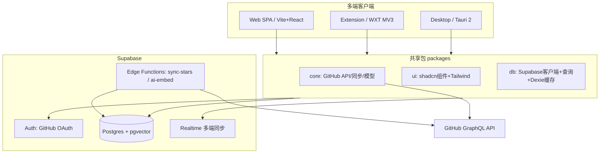
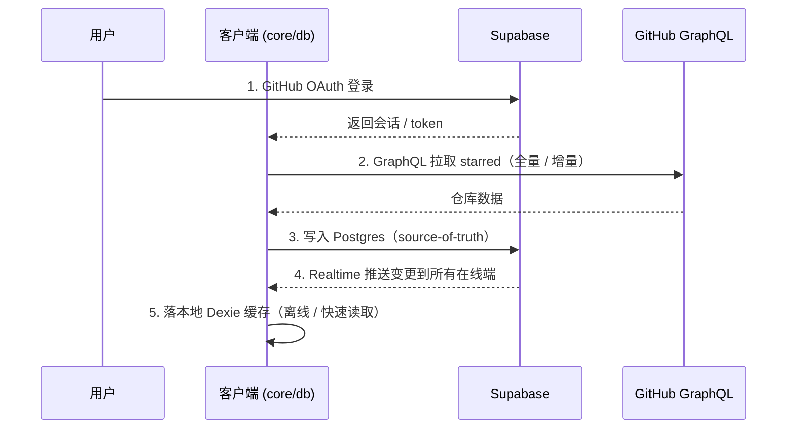

# Architecture Contract · 架构契约

> 本文件定义 Asterism 的系统架构、技术栈、monorepo 蓝图、数据流与鉴权权限边界。架构变更须同步更新本文件，并在 `../decisions/` 记录对应 ADR。

## System Architecture · 系统架构

多端客户端共享 `core` / `ui` / `db` 三个包，统一对接 Supabase（Auth / Postgres / Realtime / Edge Functions）；GitHub GraphQL API 是上游数据源。



### 分层职责

- **clients（端）**：各端只负责平台壳与组装，业务逻辑下沉到共享包。
- **shared（共享包）**：跨端复用的核心；不含任何平台专有 API（见 `conventions.md` 目录边界）。
- **Supabase（后端）**：Auth 鉴权、Postgres 作为 source-of-truth、Realtime 推送多端同步、Edge Functions 承载同步与 AI 嵌入等服务端逻辑。
- **GitHub GraphQL API**：上游数据源，由 `core` 与 Edge Functions 调用。

## Tech Stack · 技术栈

### 共享（跨端）

- **语言**：TypeScript（strict）
- **UI**：React + Tailwind CSS + shadcn/ui
- **数据请求 / 缓存**：TanStack Query
- **客户端状态**：Zustand
- **本地缓存 / 离线**：Dexie（IndexedDB）
- **大列表性能**：TanStack Virtual（虚拟滚动）
- **国际化**：react-i18next（跨 web / 扩展通用，最稳；默认 en + 内置 zh-CN）

### 各端

- **Web**：Vite + React + React Router；静态托管（Vercel / Netlify / Cloudflare Pages）。
- **Extension**：WXT（Manifest V3）；鉴权用 `chrome.identity.launchWebAuthFlow` 或共享 Supabase 会话。
- **Desktop**：Tauri 2，套用 web 前端。

### 运行时与工程基线

- Node 22 LTS、pnpm（`packageManager` 锁定）、Turborepo、Vite、Vitest、Biome、Changesets、lefthook + commitlint。
- 选型理由见 `../decisions/0001-supabase-baas.md`、`0002-pnpm-over-bun.md`、`0003-commitlint-lefthook.md`。

## Monorepo Blueprint · 仓库蓝图

> 本次初始化仅建立 monorepo 根配置，**不创建** `apps/*` 与 `packages/*` 的业务代码。下方为目标蓝图。

```text
asterism/
├── apps/
│   ├── web/            # Vite + React + React Router 的响应式 Web
│   ├── extension/      # WXT MV3 浏览器扩展
│   └── desktop/        # Tauri 2 桌面端
├── packages/
│   ├── core/           # 业务逻辑：GitHub API / 同步 / 领域模型（无平台专有 API）
│   ├── ui/             # shadcn/ui 组件 + Tailwind 设计系统
│   ├── db/             # 数据访问唯一入口：Supabase 客户端 + 查询 + Dexie 缓存
│   └── config/         # 共享工程配置（tsconfig / tailwind / biome 预设等）
└── supabase/
    ├── migrations/     # 数据库迁移（schema + RLS）
    └── functions/      # Edge Functions（sync-stars / ai-embed 等）
```

包命名遵循 `@asterism/*`；共享包为私有 workspace（不发 npm）。目录边界规则见 `conventions.md`。

## Data Flow · 数据流

核心数据流：以 GitHub 为上游、Postgres 为权威源、Realtime 为同步通道、Dexie 为本地缓存。



1. **OAuth 登录**：经 Supabase GitHub provider 获取会话。
2. **GraphQL pull stars**：`core` 调 GitHub GraphQL API 拉取 starred（支持增量）。
3. **Postgres source-of-truth**：同步结果写入 Supabase Postgres，作为权威数据源。
4. **Realtime 多端同步**：Postgres 变更经 Realtime 推送到该用户的所有在线客户端。
5. **Dexie 缓存**：客户端本地用 Dexie 缓存，支撑离线浏览与即时读取。

> 服务端密集型同步（大批量拉取、AI 嵌入）可由 Edge Functions（`sync-stars` / `ai-embed`）承担，避免客户端长时占用与速率限制问题。

## OAuth & Permissions · 鉴权与权限边界

- **Provider**：Supabase Auth 的 GitHub provider。
- **读取公开 star 列表**：无需额外 scope（用户公开的 starred 数据即可读取）。MVP 为**只读**。
- **写操作（批量 unstar / star 等）**：需要 `public_repo` scope。这属于**可选进阶能力**，默认不申请；仅在用户主动开启批量写功能时才请求该 scope。
- **最小权限原则**：默认申请满足只读浏览所需的最小 scope，避免过度授权。
- **会话**：跨端共享 Supabase 会话；扩展端可用 `chrome.identity.launchWebAuthFlow` 或共享会话两种方式之一。

权限相关的安全约束（密钥不入库、BYOK 加密等）见 `conventions.md` 与 `data-model.md`。
